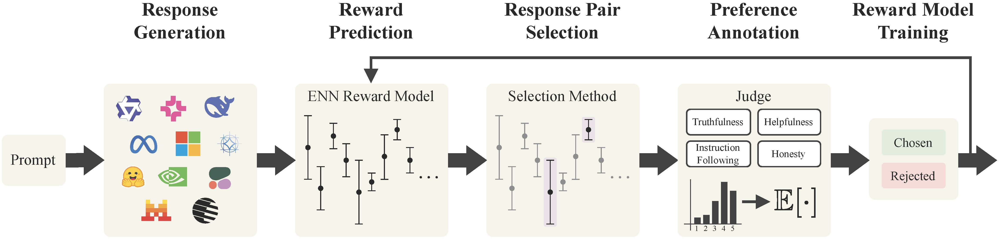

# ActiveUltraFeedback: Efficient Preference Data Generation using Active Learning


[](https://arxiv.org/abs/2603.09692)
[](https://huggingface.co/ActiveUltraFeedback)
[](https://opensource.org/licenses/Apache-2.0)


## Introduction

This repository contains the code for **ActiveUltraFeedback**, a **modular active learning pipeline** for generating high-quality **preference datasets** from a dataset of prompts. It is meant to be used as a **reproducible artifact** and as a **modular platform** to experiment with custom response pair selection methods, judges, uncertainty quantification methods, ...

The implementation supports:

- **Response Pair Selection Methods**: 
  - Baseline Heuristics (Random, UltraFeedback, MaxMin, DeltaQwen)
  - Dueling Bandit Methods (InfoMax, Double Thompson Sampling, MaxMinLCB)
  - Novel methods from the paper, Double Reverse Thompson Sampling (DRTS) and DeltaUCB
- **Judges**: 
  - Rubric-based LLM-as-a-Judge
  - Reward Models
- **Uncertainty Quantification Methods**: Methods supported by [`rewarduq`](https://github.com/lasgroup/rewarduq) 

In experiments, datasets from out pipeline match or beat **static** annotation strategies while using **roughly one-sixth of the labels** in comparable setups. Our preference datasets generated with our pipeline are released on **[Hugging Face](https://huggingface.co/ActiveUltraFeedback)**.

## Overview



The pipeline operates in a loop. A single iteration with a batch of prompts consists of:

1. **Response Generation**: Sample multiple candidate responses per prompt from a diverse model pool.
2. **Reward Prediction**: An uncertainty-aware reward model outputs scores and the associated uncertainty.
3. **Response Pair Selection**: An response pair selection method picks **two** responses, based on the rewards and uncertainties.
4. **Preference Annotation**: An oracle labels the selected pair to identify the chosen and rejected response.
5. **Reward Model Training**: Train the reward model on the new preferences and iterate.

## Getting Started

### Installation

#### Option 1: Docker (Recommended)

For NVIDIA GH200 (aarch64) based systems with CUDA 13.1, we provide a Dockerfile based on the NVIDIA vLLM image. For other systems, you can use the Dockerfile as a template to build your own image.

```bash
# Build the image
podman build . -t activeuf

# Export for cluster use (enroot/squashfs)
enroot import -x mount -o activeuf.sqsh podman://localhost/activeuf:latest
```

#### Option 2: Local Installation

For local development, we provide a `requirements.txt` file and a `pyproject.toml` file for use with [`uv`](https://docs.astral.sh/uv/) (recommended). You can use them to create a virtual environment and install the dependencies. This setup was tested on an RTX 5090 with CUDA 13.0.

```bash
# uv setup
uv venv --python 3.12

# Install PyTorch
uv pip install torch==2.10.0 torchvision==0.25.0 --index-url https://download.pytorch.org/whl/cu130

# Install vLLM with for CUDA 13.0
export VLLM_VERSION=0.19.0
export CUDA_VERSION=130
export CPU_ARCH=$(uname -m)
uv pip install "https://github.com/vllm-project/vllm/releases/download/v${VLLM_VERSION}/vllm-${VLLM_VERSION}+cu${CUDA_VERSION}-cp38-abi3-manylinux_2_35_${CPU_ARCH}.whl" --extra-index-url "https://download.pytorch.org/whl/cu${CUDA_VERSION}" --index-strategy unsafe-best-match --prerelease=allow

# Install remaining dependencies
uv pip install -r requirements.txt
```

### Usage

You can find an example script running the entire pipeline on dummy data in [`scripts/example.sh`](./scripts/example.sh).

#### 0. Data Pre-processing

Use a Hugging Face [`Dataset`](https://huggingface.co/docs/datasets). Each row must validate as [`PromptWithCompletions`](./activeuf/schemas.py):

| Column | Type | Notes |
|--------|------|-------|
| `prompt_id` | `str` | Unique id per example. |
| `source` | `str` | Source of the prompt |
| `prompt` | `str` | The prompt |
| `completions` | [`List[Completion]`](./activeuf/schemas.py) | Optional. Used to for filtering out already-generated completions when continuing a previous run. |

#### 1. Response Generation

Generate responses for the prompts in the dataset for all models in your model pool individually. (See [`scripts/completions/`](./scripts/completions/) for examples to run the response generation for an entire model pool)

```shell
export MODEL="Qwen/Qwen3-0.6B"
export MODEL_NAME="Qwen3-0.6B"

python -m activeuf.completions.generate_completions \
    --dataset_path <PATH_TO_DATASET> \
    --model_name ${MODEL} \
    --model_class vllm \
    --output_path ./datasets/1_individual_completions/${MODEL_NAME}
```

After generating the completions, merge them into a single dataset using:

```bash
python -m activeuf.completions.merge_completions \
  --datasets_path ./datasets/1_individual_completions \
  --output_path ./datasets/2_merged_completions \
```

#### 2. Response Annotation

To avoid repeating the same annotations, we pre-compute the annotations for all responses. (See [`scripts/oracle/run_annotations.sh`](./scripts/oracle/run_annotations.sh) for an example script running the annotation for all responses in parallel on a cluster)

```bash
export MODEL_TO_ANNOTATE="Qwen/Qwen3-0.6B"
export MODEL_NAME="Qwen3-0.6B"
export JUDGE_MODEL="Qwen/Qwen3-32B"

python -m activeuf.oracle.get_raw_annotations \
    --model_name ${JUDGE_MODEL} \
    --model_to_annotate ${MODEL_TO_ANNOTATE} \
    --dataset_path ./datasets/2_merged_completions \
    --model_class vllm \
    --output_path ./datasets/3_annotated_completions/${MODEL_NAME}
```

Similar to response generation, after generating the annotations, merge them into a single dataset using:

```bash
python -m activeuf.oracle.combine_annotated_completions \
  --annotations_folder ./datasets/3_annotated_completions \
  --completions_folder ./datasets/1_individual_completions \
  --output_folder ./datasets/4_merged_annotations
```

#### 4. Main Loop

Run the main loop, running response pair selection and reward model training.

```bash
python -m activeuf.loop.run --config_path configs/loop.yaml
```

Edit [`configs/loop.yaml`](./configs/loop.yaml) to point `inputs_path`, `oracle_name`, `acquisition_function_type`, and reward-model settings at your data and models.

## Structure

```
activeuf/
├── acquisition_function/               # Response Pair Selection Methods
├── completions/                        # Response Generation
├── cpo/                                # CPO training for evals
├── dpo/                                # DPO training for evals
├── loop/                               # Main Loop
├── oracle/                             # Response Annotation
├── reward_model/                       # Reward model training for evals
├── schemas.py                          # Pydantic models for datasets and completions
└── utils.py                            # Shared helpers (models, logging, sampling)
```

## Contributing

We welcome contributions—new acquisition rules, oracles, fixes, or documentation improvements.

1. Check [Issues](https://github.com/lasgroup/ActiveUltraFeedback/issues) or open one to discuss a change.
2. Fork the repository
3. Implement your changes
4. Open a [Pull Request](https://github.com/lasgroup/ActiveUltraFeedback/pulls).

## Citation

```bibtex
@misc{melikidze2026activeultrafeedbackefficientpreferencedata,
  title={ActiveUltraFeedback: Efficient Preference Data Generation using Active Learning},
  author={Davit Melikidze and Marian Schneider and Jessica Lam and Martin Wertich and Ido Hakimi and Barna Pásztor and Andreas Krause},
  year={2026},
  eprint={2603.09692},
  archivePrefix={arXiv},
  primaryClass={cs.LG},
  url={https://arxiv.org/abs/2603.09692},
}
```

## License

This repository’s source code is available under the [Apache-2.0 License](LICENSE).
